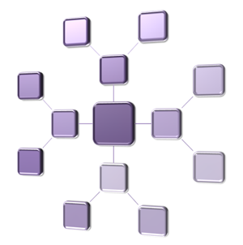

# Overview

> Dependency injection is the art of making work come home to you.  
>   Dhanji R. Prasanna

WireBox alleviates the need for custom object factories or manual object creation in your ColdFusion (CFML) applications. It provides a **standardized** approach to object **construction** and **assembling** that will make your code easier to adapt to changes, easier to [test, mock](https://testbox.ortusbooks.com) and extend.

As software developers we are always challenged with maintenance and one ever occurring annoyance, **change**. Therefore, the more sustainable and maintainable our software, the more we can concentrate on real problems and make our lives more productive. WireBox leverages an array of metadata annotations to make your object assembling, storage and creation easy as pie! We have leveraged the power of event driven architecture via object listeners or interceptors so you can extend not only WireBox but the way objects are analyzed, created, wired and much more. To the extent that our [AOP](/aspect-oriented-programming/README.md) capabilities are all driven by our AOP listener which decouples itself from WireBox code and makes it extremely flexible.

We have also seen the value of a central location for object configuration and behavior so we created our very own **WireBox Programmatic Mapping DSL** \([Domain Specific Language](http://en.wikipedia.org/wiki/Domain-specific_language)\) that you can use to define object construction, relationships, AOP, etc in pure ColdFusion (No XML!). We welcome you to stick around and read our documentation so you can see the true value of **WireBox** in your web applications.

## Features at a Glance

Here are a simple listing of features WireBox brings to the table:

* Annotation driven dependency injection
* 0 configuration mode or a programmatic binder configuration approach via ColdFusion \(No XML!\)
* Creation and Wiring of or by:
  * ColdFusion Components
  * Java Classes
  * RSS Feeds
  * WebService objects
  * Constant values
  * DSL string building
  * Factory Methods
* Multiple Injection Styles: Property, Setter, Method, Constructor
* Automatic Package/Directory object scanning and registration
* Multiple object life cycle persistence scopes:
  * No Scope \(Transients\)
  * Singletons
  * Request Scoped
  * Session Scoped
  * Application Scoped
  * Server Scoped
  * CacheBox Scoped
* Integrated logging via [LogBox](https://logbox.ortusbooks.com), never try to figure out what in the world the DI engine is doing
* Parent Factories
* Factory Method Object Creations
* Object life cycle events via WireBox Listeners/Interceptors
* Customizable injection DSL
* WireBox object providers to avoid scope-widening issues on time/volatile persisted objects
* [Aspect Oriented Programming](/aspect-oriented-programming/README.md)
* [Standalone ORM Entity Injection](../orm-entity-injection.md)

## Useful Resources

* [http://code.google.com/p/google-guice](http://code.google.com/p/google-guice)
* [http://www.manning.com/prasanna/](http://www.manning.com/prasanna/)
* [http://en.wikipedia.org/wiki/Aspect-oriented\_programming](http://en.wikipedia.org/wiki/Aspect-oriented_programming)
* [http://en.wikipedia.org/wiki/Dependency\_injection](http://en.wikipedia.org/wiki/Dependency_injection)
* [http://en.wikipedia.org/wiki/Inversion\_of\_control](http://en.wikipedia.org/wiki/Inversion_of_control)
* [http://martinfowler.com/articles/injection.html](http://martinfowler.com/articles/injection.html)
* [http://www.theserverside.com/news/1321158/A-beginners-guide-to-Dependency-Injection](http://www.theserverside.com/news/1321158/A-beginners-guide-to-Dependency-Injection)
* [http://www.developer.com/net/net/article.php/3636501](http://www.developer.com/net/net/article.php/3636501)
* [http://code.google.com/p/google-guice/](http://code.google.com/p/google-guice/)

